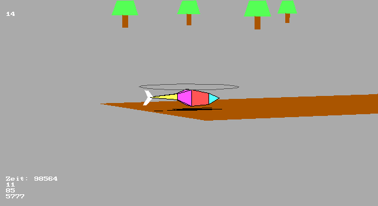

# MFS Modellflugsimulator '94 Edition

MFS94 was my second version of a 3D R/C helicopter simulator for the PC. It was written in 1994 for [MS-DOS](https://en.wikipedia.org/wiki/MS-DOS), supporting an [EGA graphics card](https://en.wikipedia.org/wiki/Enhanced_Graphics_Adapter) with a resolution of 640x350 and 16 colors.

As there were no graphics libraries at the time, all the 3D rendering was done manually, such as vector math, Bresenham, and the BSP (Binary Space Partitioning) algorithm from Henry Fuchs.

As a special feature, MFS supports an external R/C transmitter for controlling the helicopter movement. The PPM signal of the R/C transmitter (I was the proud owner of a Multiplex Profi mc 3030) needs to be connected to the PCs serial port CTS pin via a signal level converter.

To compile the project, you need Borland Turbo C and TASM. Precompiled binaries can be found in the bin folder.

Some time later, MFS94 evolved to [MFS96](https://github.com/mariusgreuel/mfs96)

## Screenshot

## System Requirements

- A MS-DOS PC with an EGA graphics card
- A R/C transmitter with the PPM signal connected to a serial ports CTS pin

Today, a virtual machine with Windows 95 will do, although you won't be able to use the R/C transmitter connected to a serial port.

## License

MFS94 is released under the GNU GPLv2.

Copyright (C) 1994 Marius Greuel. All rights reserved.
